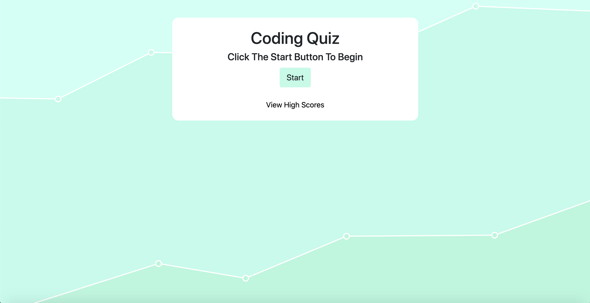

# Coding Quiz

## About The Program

This program is a coding quiz.  However, the format of this quiz is different from a standard quiz.  The user starts with 50 seconds of time.  After the quiz starts, the timer begins running.  When the user answers a question correctly, 10 seconds is added to the timer.  When the user answers a question incorrectly, 10 seconds is deducted from the timer.  The quiz ends when all the questions are answered or the time remaing reaches 0.  

Upon completion, the quiz is scored based on the amount of time remaining.  The more time remaing, the more points the user gets on the quiz.  At the end of the quiz, the user is propmted to recored their score.  These scores are stored in local storage and can be view on the highscore page.  These scores can also be cleared from local storage if desired via a button included on the highscore page.  

The program can be viewed live at using the link below.  
https://markmulligan97.github.io/codingQuiz/

